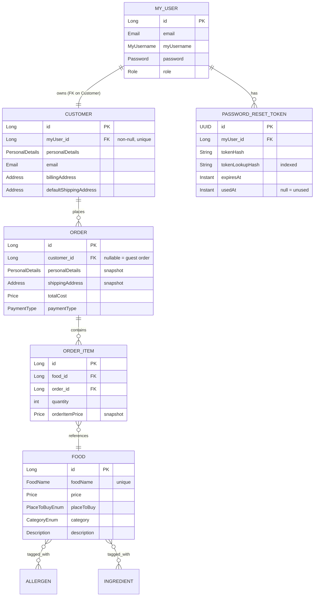
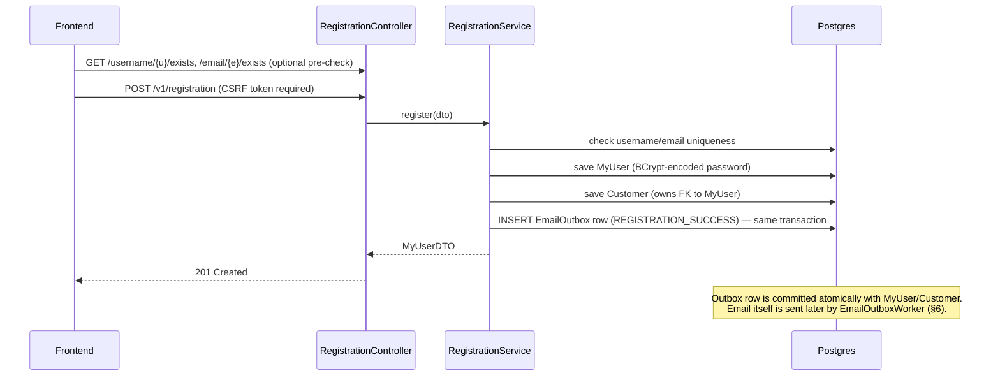
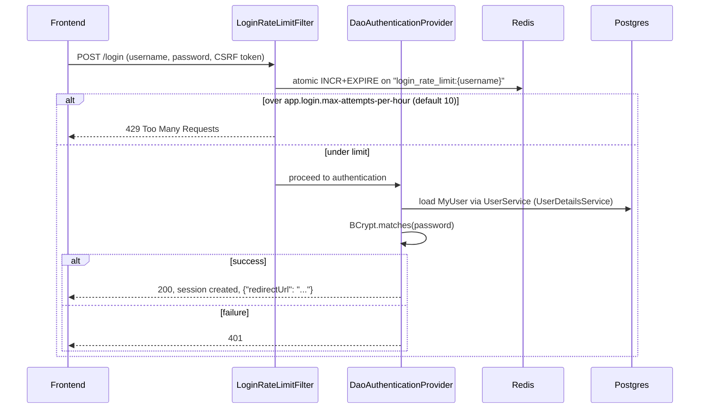
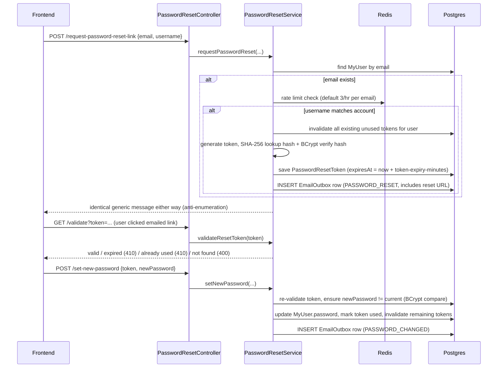
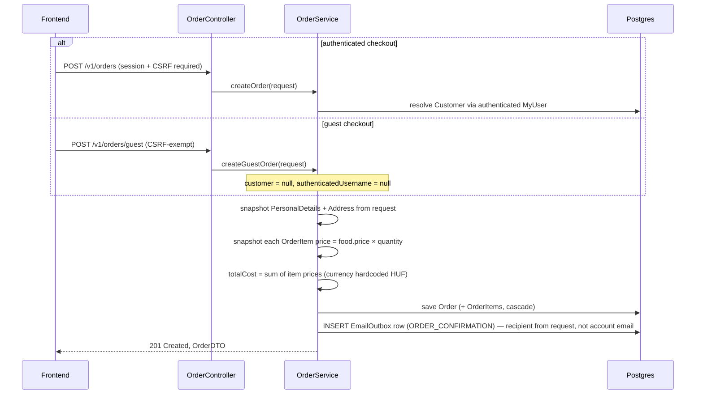
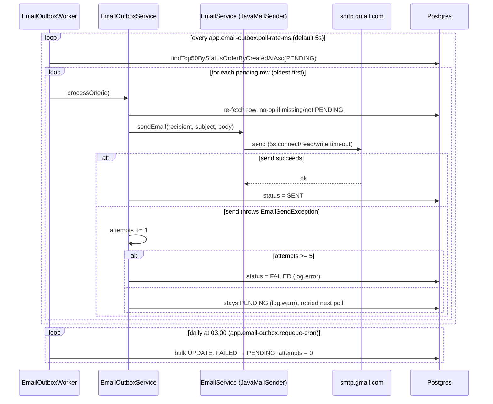

# ImagineBar API — Detailed Design Description

## 1. Overview & Purpose

ImagineBar is a Spring Boot REST API for a restaurant/bar food-ordering system: browsing a
menu, registering/authenticating, managing a customer profile, and placing orders (as a guest
or as a logged-in customer). This document describes the system **as implemented today** —
domain model, API surface, functional flows, and the cross-cutting concerns (security, rate
limiting, error handling, email delivery) that shape how those flows behave.

**Audience**: engineers onboarding onto or working in this codebase who need more depth than
`CLAUDE.md`'s quick-reference bullets — e.g. "what emails does the system send, and exactly when
do they get sent?"

**Scope**: the backend API only (this repository). Frontend behavior is out of scope except
where it's load-bearing for backend design decisions (e.g. CORS origin, password-reset link
format).

For a terser architectural cheat-sheet (build commands, layering conventions, workflow rules),
see `CLAUDE.md` at the repo root. This document goes deeper on *why* and *when*.

---

## 2. Architecture at a Glance

**Stack**: Spring Boot 3.4.5, Java 17, Gradle, Postgres (Postgres 16 in Docker), Redis 7 (rate
limiting only), H2 (tests only).

**Layering**: `Controller → Service → Repository`, with `converter/` classes translating between
JPA entities (`data/`) and API DTOs (`dto/`). Controllers and services never return entities
directly.

**Value-object modeling convention**: most entity fields are individually wrapped `@Embeddable`
value classes (e.g. `FoodName`, `Price`, `Email`, `MyUsername`) rather than plain primitives. Each
pairs with a `*Utils` class holding validation constants/messages and a matching `*DTO` for API
I/O. Adding or changing a field means touching all three — see `data/food/FoodName.java` +
`util/foodUtils/FoodNameUtils.java` + `dto/food/FoodNameDTO.java` as the reference example.

**Deployment topology** (`docker-compose.yml`): three services — `app`, `postgres`, `redis` —
with the app depending on both via `condition: service_healthy`. `docker-compose` always forces
`SPRING_PROFILES_ACTIVE=dev` on the `app` service.

**Health check**: `spring-boot-starter-actuator` exposes `GET /actuator/health`, reporting an
aggregate `UP`/`DOWN` status. `management.health.mail.enabled=false` deliberately excludes the
auto-configured mail indicator (which would otherwise open a live SMTP connection on every health
check) — the auto-configured datasource/Redis/disk-space indicators still contribute. Excluding
mail is consistent with the outbox design (§6): email delivery is already async and retried, so a
transient SMTP outage shouldn't make the whole app read as down. Before this indicator was added,
`/actuator/health` had no implementing dependency at all, so it 404'd despite being permitted in
`SecurityConfig` and referenced by `docker-compose.yml`/this doc — see §9 for the related fix to
how unmapped routes are reported.

**CI**: `.github/workflows/ci.yml` runs `./gradlew build` (compile + full test suite) on every
push and PR against `main`. The `test` profile is fully self-contained (H2 in-memory, mocked
Redis), so no service containers are needed in the runner.

**Spring profiles**:

| Profile | File | `ddl-auto` | Seeding | Notes |
|---|---|---|---|---|
| default | `application.yml` | `validate` | none (`sql.init.mode: never`) | Production-shaped; expects a pre-provisioned schema and all env vars set. |
| `dev` | `application-dev.yml` | `create-drop` | `data.sql` (`sql.init.mode: always`) | Used by Docker Compose; verbose logging; login rate limit relaxed to 1000/hr. |
| `test` | `application-test.yml` | `create-drop` | none | H2 in-memory; Redis is mocked out (`TestRedisConfig` supplies a stubbed `RedisConnectionFactory`) so `RedisAutoConfiguration` backs off — no real Redis is ever contacted in tests. |

---

## 3. Domain Model

| Entity | Purpose | Key relationships |
|---|---|---|
| `MyUser` | Authentication identity (login credentials + role). | 1:1 owning-inverse pair with `Customer` (see below); 1:N `PasswordResetToken`. |
| `Customer` | Customer profile: personal details, billing address, shipping addresses, orders. | Owns the FK to `MyUser` (`MYUSER_ID`, non-null); 1:N `Order` (cascade ALL, orphan removal). |
| `Food` | A menu item. | M:N `Allergen`, M:N `Ingredient`. |
| `Allergen` / `Ingredient` | Read-only reference/lookup data for menu tagging. | M:N back to `Food`. |
| `Order` | A placed order. **Snapshots** `PersonalDetails`, shipping `Address`, and item prices at order time rather than referencing live `Customer`/`Food` state — so later profile or menu-price edits never retroactively change a past order. | M:1 `Customer`, **nullable** (`null` = guest order); 1:N `OrderItem` (cascade ALL, orphan removal). |
| `OrderItem` | A line item: food reference + quantity + price snapshot (`unit price × quantity` at order time). | M:1 `Food`, M:1 `Order`. |
| `PasswordResetToken` | Single-use, time-limited password-reset token. Dual-hash design: `tokenLookupHash` (SHA-256, indexed) for fast DB lookup, `tokenHash` (BCrypt) for constant-time verification — "defense in depth." | M:1 `MyUser`. |
| `EmailOutbox` | A queued, retryable email (see §6). | None (denormalized: stores `recipientEmail` as a plain string, not a FK). |

**Why `MyUser` and `Customer` are separate entities**: `MyUser` is the login/authentication
identity (username, password hash, role); `Customer` is the order-facing profile (name, addresses).
`Customer` holds the owning, non-nullable FK to `MyUser` — every `Customer` has exactly one
`MyUser`, but the split lets authentication concerns (role, credentials) stay independent of
profile concerns (addresses, order history).

---

## 4. API Surface

For exact request/response JSON shapes per endpoint (frontend-facing reference), see
`docs/API_ENDPOINTS.md`.

| Controller | Method & Path | Auth | Purpose |
|---|---|---|---|
| `AuthController` | `GET /auth-status` | Public | Session probe — 200 if authenticated, 401 otherwise. |
| `CsrfController` | `GET /csrf-token` | Public | Issues the CSRF token for the current session (SPA bootstrap). |
| `RegistrationController` | `GET /v1/registration/username/{u}/exists` | Public, rate-limited (20/hr per value) | Username-availability check. |
| | `GET /v1/registration/email/{e}/exists` | Public, rate-limited (20/hr per value) | Email-availability check. |
| | `POST /v1/registration/common-password` | Public | Checks a candidate password against a common-password list. |
| | `POST /v1/registration` | Public, **CSRF required** | Registers a new `MyUser` + `Customer`. |
| `AccountController` | `GET /v1/account/me` | Authenticated | Returns the authenticated user's profile. |
| | `PATCH /v1/account/password` | Authenticated | Changes password (requires current password). |
| `CustomerController` | `GET /v1/customers` | Authenticated, `ROLE_ADMIN` | Lists all customers. |
| | `PUT /v1/customer/billing-address` | Authenticated | Updates the authenticated customer's billing address. |
| | `PUT /v1/customer/shipping-address` | Authenticated | Updates/adds the default shipping address. |
| | `PATCH /v1/customer/personal-details` | Authenticated | Updates personal details. |
| `FoodController` | `GET /v1/foods` | Public | Lists all foods as menu items. |
| | `POST /v1/foods/cart` | Public | Resolves shopping-cart line items by food ID ("read via POST", not a mutation). |
| | `GET /v1/foods/menu/{placeToBuy}` | Public | Lists menu items for a `PlaceToBuyEnum` value. |
| | `GET /v1/foods/{id}` | Public | Full food detail by ID. |
| | `POST /v1/foods` | Authenticated | Creates a new food (menu item). |
| `AllergenController` | `GET /v1/allergens` | Public | Lists all allergens. |
| `IngredientController` | `GET /v1/ingredients` | Public | Lists all ingredients. |
| `OrderController` | `POST /v1/orders` | Authenticated | Creates an order tied to the logged-in customer. |
| | `POST /v1/orders/guest` | Public, CSRF-exempt | Creates a guest order (no `Customer` link). |
| | `GET /v1/orders/{id}` | Authenticated, ownership-checked | Fetches an order — 404 if it belongs to a different customer, or has no customer at all (guest orders are unreachable through this endpoint). |
| `PasswordResetController` | `POST /v1/password-reset/request-password-reset-link` | Public | Requests a reset email. |
| | `GET /v1/password-reset/validate?token=` | Public | Validates a reset token (GET by deliberate design — see §7). |
| | `POST /v1/password-reset/set-new-password` | Public | Consumes a token, sets a new password. |

Not REST controllers, but part of the API surface — defined in `SecurityConfig` via Spring
Security's form-login DSL: `POST /login` (JSON success/failure handlers) and `POST /logout`.

---

## 5. Core Functional Flows

### 5.1 Registration

`MyUser` is saved before `Customer` because `Customer.myUser` is the non-nullable owning FK.

### 5.2 Login

The rate limiter increments **before** authentication is attempted, on every `POST /login`
regardless of outcome — a two-step check-then-increment would let concurrent requests race past
the limit.

### 5.3 Password Reset

The response to `request-password-reset-link` is identical whether or not the email/username
combination matched — deliberate anti-enumeration behavior.

**Separate flow — authenticated password change**: `PATCH /v1/account/password`
(`AccountService.updateAuthenticatedUserPassword`) verifies the *current* password via BCrypt
match and updates directly — no token involved. It queues the same `PASSWORD_CHANGED` outbox
email as the token-based reset flow, but via a distinct code path.

### 5.4 Order Placement (guest vs. authenticated)

Both paths funnel through the same `persistOrder` helper and both queue an `ORDER_CONFIRMATION`
email. There is no stock/inventory tracking — `Food` has no quantity field, so ordering is
unconstrained by availability. Allergens/ingredients are purely informational/display data; no
allergy-based order validation exists.

`GET /v1/orders/{id}` ownership check compares `order.customer.id` to the authenticated user's
`customer.id`; since guest orders have `customer = null`, they are unreachable via this endpoint
(always 404) — there is currently no guest order-lookup mechanism (e.g. by order ID + email).

---

## 6. Email / Notification Subsystem

This is a **transactional outbox**, not a synchronous send and not an in-process event listener.
(An earlier iteration of this codebase used `@TransactionalEventListener(phase = AFTER_COMMIT)`
with an `EmailEventListener` and domain events like `RegistrationSuccessEvent` — that design was
replaced by this branch, `feature/transactional-email-outbox`, commit `e7b154c`. See §6.4.)

### 6.1 What gets sent, when, and to whom

All four email types are plain-text (`SimpleMailMessage`, no HTML templates), built by
`EmailService`, in Hungarian:

| `EmailType` | Trigger (service / method) | Recipient | Content |
|---|---|---|---|
| `REGISTRATION_SUCCESS` | `RegistrationService.register()` — after `MyUser`+`Customer` are persisted | New account's registration email | Welcome message confirming the account was created. |
| `PASSWORD_RESET` | `PasswordResetService.requestPasswordReset()` — email exists, rate limit OK, username matches | Account's email | Explains a reset was requested, includes the reset link (`{frontendUrl}/forgot-password?token=...`), tells the user to ignore it if unrequested. |
| `PASSWORD_CHANGED` | `PasswordResetService.setNewPassword()` (token-based reset) **or** `AccountService.updateAuthenticatedUserPassword()` (in-app change) | Account's email | Confirms the password was changed; asks the user to contact support if they didn't do it. |
| `ORDER_CONFIRMATION` | `OrderService.persistOrder()` — every successfully saved order, guest or authenticated | Contact email from the order request itself (not necessarily the account email) | Itemized order (qty × item, price), total cost, payment method ("Bankkártya"/"Készpénz"). |

### 6.2 How it works — write path

Each triggering service writes an `EmailOutbox` row **inside the same `@Transactional` business
method** as the domain change it's confirming — e.g. `RegistrationService.register()` saves
`MyUser`+`Customer` and the `EmailOutbox` row in one transaction. This guarantees the email
request and the business state either both commit or both roll back; there's no window where the
business change succeeds but the email intent is lost (or vice versa).

`EmailOutbox` schema: `id` (UUID), `recipientEmail`, `emailType`, `subject`, `body` (TEXT),
`status` (`PENDING` / `SENT` / `FAILED`, default `PENDING`), `attempts` (default 0),
`createdAt`, `lastAttemptAt`.

### 6.3 How it works — delivery path

- `EmailOutboxWorker.processPendingEmails()` — `@Scheduled(fixedRateString =
  "${app.email-outbox.poll-rate-ms:5000}")`, batch of 50, oldest-first.
- `EmailOutboxWorker.requeueFailedEmails()` — `@Scheduled(cron =
  "${app.email-outbox.requeue-cron:0 0 3 * * *}")`, daily 03:00, resets `FAILED` rows back to
  `PENDING` with `attempts = 0` for another try.
- `EmailOutboxService.processOne(id)` — `MAX_ATTEMPTS = 5`; escalates from `log.warn` per failed
  attempt to `log.error` ("giving up") once attempts are exhausted.

### 6.4 Why the outbox replaced the old event-listener design

The old design (`EmailEventListener`, `@TransactionalEventListener(phase = AFTER_COMMIT)`) had
two problems this outbox fixes:

1. **No SMTP timeout on the request thread** — a slow or unreachable mail server could hang the
   HTTP response indefinitely, since the send happened synchronously (after commit, but still on
   a thread the listener blocked). The outbox decouples the send entirely: the HTTP request only
   writes a fast DB row; the actual SMTP call happens later on a `@Scheduled` worker thread. The
   fix is reinforced by explicit SMTP timeouts now set in `application.yml`
   (`connectiontimeout`/`timeout`/`writetimeout: 5000` ms).
2. **In-memory event, no persistence** — if the process crashed between the DB commit and the
   Spring event's listener finishing, the email was silently lost (failures were only logged, never
   retried or recorded). The outbox row is committed to Postgres in the same transaction as the
   business change, so it survives a crash and gets picked up by the next poll cycle.

The scheduling thread pool was also enlarged (`spring.task.scheduling.pool.size: 5`) so a slow
mail send can't starve the outbox poller or other `@Scheduled` jobs (e.g. password-reset-token
cleanup, §11).

### 6.5 Known limitations

- **At-least-once delivery, no idempotency key**: if a send succeeds at the SMTP server but the
  subsequent `status = SENT` write is interrupted, the row stays `PENDING`/`FAILED` and could be
  resent — theoretically a double-send. There's no dedup key on the outbound message.
- **Single-worker-instance assumption**: rows are claimed via a plain `findTop50By...` query, not
  `SELECT ... FOR UPDATE SKIP LOCKED`. Running more than one app instance risks two workers
  processing (and double-sending) the same row.
- **Plain-text, Hungarian-only**: no HTML templates, no i18n/localization — all copy is hardcoded
  Hungarian text in `EmailService`.

---

## 7. Security Model

Defined in `config/SecurityConfig.java`.

- **Session-based auth**: classic server-side session (`JSESSIONID`), Spring Security default
  `SessionCreationPolicy.IF_REQUIRED`. Session fixation protection migrates the session on login
  (`sessionFixation().migrateSession()`).
- **Password hashing**: BCrypt (`BCryptPasswordEncoder`), wired into a `DaoAuthenticationProvider`.
- **CORS**: a single allowed origin (`app.frontend.url`), methods `GET/POST/PUT/DELETE/OPTIONS`,
  all headers, `allowCredentials=true` (required for cookie-based sessions cross-origin).
- **Security headers**: CSP `default-src 'self'`, `X-Frame-Options: DENY` (clickjacking
  protection), `X-Content-Type-Options: nosniff`.
- **CSRF exemption list** — path-scoped, each with a specific reason (read the inline comments in
  `SecurityConfig.java` before changing any endpoint's status):

  | Exempt path | Why |
  |---|---|
  | `/auth-status`, `/csrf-token`, `/login` | Bootstrap endpoints needed before a CSRF token can even be obtained. |
  | `/v1/foods/**` (GET only), `/v1/foods/cart` (POST) | Menu is public; the cart POST is a read (price lookup), not a mutation. |
  | `/v1/allergens`, `/v1/ingredients` | Public reference data. |
  | `/v1/password-reset/**` | Must function for an unauthenticated user with no session/CSRF token. |
  | `/v1/orders/guest` (POST only) | **Only** guest checkout is exempt — `POST /v1/orders` (authenticated) and `GET /v1/orders/{id}` both still require CSRF/auth. This asymmetry is intentional: guest checkout has no session to derive a CSRF token from. |
  | `/actuator/health` | Health checks. |
  | `/v1/registration/common-password` (POST) | A pure read (password-strength check) despite being a POST. Actual signup (`POST /v1/registration`) is deliberately **not** exempt — the frontend must fetch and send a CSRF token to register. |

- **Authorization**: `GET /v1/customers` requires `ROLE_ADMIN`; `POST /v1/foods` requires
  authentication; all other `/v1/foods/**` and the permit-listed public paths are open;
  everything else falls through to `anyRequest().authenticated()`.
- `LoginRateLimitFilter` is deliberately **not** a `@Bean` — a `Filter` registered as a bean gets
  auto-registered a second time by Spring's `FilterRegistrationBean`, on top of the explicit
  `addFilterBefore(...)`, which would double-count every login attempt.

---

## 8. Rate Limiting

`service/RedisService.java` exposes an atomic Lua script (INCR + conditional EXPIRE-on-first-write)
via `RedisTemplate.execute`, ensuring the increment and TTL-set happen as a single atomic
operation — a non-atomic check-then-increment would let concurrent requests race past the limit.

| Guard | Key prefix | Default limit | Window |
|---|---|---|---|
| Login attempts | `login_rate_limit:{username}` | 10/hr (`app.login.max-attempts-per-hour`; 1000/hr in `dev`) | 1hr from first attempt in window |
| Password-reset requests | `password_reset_rate_limit:{email}` | 3/hr (`app.password-reset.max-requests-per-hour`) | 1hr |
| Username/email existence probes | `username_exists_rate_limit:{value}` / `email_exists_rate_limit:{value}` | 20/hr per queried value | 1hr |

All three exist to blunt enumeration/brute-force: login guessing, password-reset spam, and
probing whether a given username/email is already registered.

---

## 9. Error Handling Contract

`exception/GlobalExceptionHandler.java` (`@ControllerAdvice`) is the single place mapping
exceptions to JSON responses — either `{"error": "..."}` or a `{field: [messages]}` map for
validation failures.

| Exception | Status | Shape |
|---|---|---|
| `TokenNotFoundException`, `InvalidPasswordException`, `IllegalArgumentException` | 400 | `{"error": ...}` |
| `TokenAlreadyUsedException`, `TokenExpiredException` | 410 Gone | Well-formed but logically invalid request — token *was* valid, isn't anymore. |
| `RateLimitExceededException` | 429 | `{"error": ...}` |
| `MethodArgumentNotValidException`, `ConstraintViolationException` | 400 | `{field: [sorted messages]}` |
| `HttpMessageNotReadableException` | 400 | Generic "Malformed request body." |
| `HttpRequestMethodNotSupportedException` | 405 | |
| `MissingServletRequestParameterException`, `MethodArgumentTypeMismatchException` | 400 | |
| `NumberParseException` (libphonenumber) | 400 | |
| `DataIntegrityViolationException` | 409 | Generic "conflict" message — doesn't leak DB detail. |
| `NoSuchElementException`, `EmptyResultDataAccessException`, `UsernameNotFoundException` | 404 | Grouped handler. |
| `NoResourceFoundException` | 404 | Thrown by `DispatcherServlet` for any unmapped/mistyped URL. Has its own handler specifically so it doesn't fall through to the generic 500 catch-all below — since `@ControllerAdvice` is global, without this every unroutable path (not just app-specific 404s) reported itself as a server error rather than "not found." |
| `IllegalStateException` | 500 | Treated as a server bug; logged at `error`. |
| `Exception` (catch-all) | 500 | Logged at `error`, generic message returned to the client. |

---

## 10. Validation Rules

Custom annotations in `validation/`, each backed by its own `*Validator`:

| Annotation | Enforces |
|---|---|
| `NoForbiddenValue` | Field value isn't in a configured forbidden set (optionally also rejects values starting `"0/"`). |
| `NotEmptyList` | List isn't null/empty (a deliberate hand-rolled duplicate of `@NotEmpty`, kept as the reference example for the custom-annotation pattern). |
| `ValidPhoneNumber` | Normalizes Hungarian local (`06...`) to `+36...`, then validates via Google `libphonenumber`. |
| `NewPasswordMatchesConfirmNewPassword` | Class-level on `NewPasswordDetailsDTO`: `newPassword == confirmNewPassword`. |
| `NewPasswordMatchesCurrentPassword` | Class-level on `PasswordChangeDTO`: new password must **differ** from the current one. |

---

## 11. Scheduled Jobs

| Job | Class | Schedule (property, default) | Purpose |
|---|---|---|---|
| `cleanupExpiredTokens` | `PasswordResetService` | `app.password-reset.cleanup-rate-ms` (hourly) | Deletes expired `PasswordResetToken` rows. |
| `processPendingEmails` | `EmailOutboxWorker` | `app.email-outbox.poll-rate-ms` (5s) | Sends up to 50 oldest pending outbox emails per tick. |
| `requeueFailedEmails` | `EmailOutboxWorker` | `app.email-outbox.requeue-cron` (daily 03:00) | Resets `FAILED` outbox rows to `PENDING` for retry. |

---

## 12. Known Limitations / Tech Debt

- **No stock/inventory tracking** — `Food` has no quantity field; orders are never blocked by
  availability.
- **Hardcoded currency** — `Order.totalCost` currency is always `CurrencyEnum.HUF`, regardless of
  each `Food.price`'s stored currency.
- **No allergen-based order validation** — allergens/ingredients are display-only; nothing
  prevents ordering a food against a stated allergy.
- **Email outbox assumes a single worker instance** and offers at-least-once (not exactly-once)
  delivery (§6.5).
- **No guest order lookup** — `GET /v1/orders/{id}` is unreachable for guest orders (`customer =
  null`), and there's no alternative lookup path (e.g. by order ID + contact email).
- **Emails are plain-text, Hungarian-only** — no HTML templates, no i18n.
